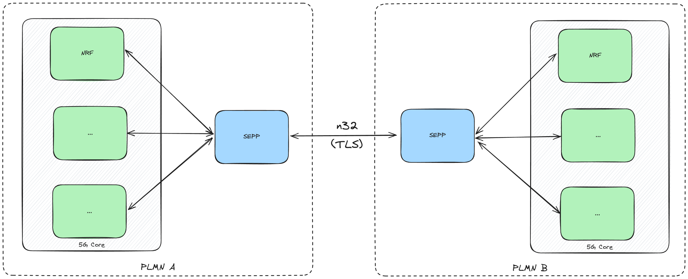

# Security Edge Protection Proxy (SEPP)

> :construction: This project is under development

An open source implementation of the 5G Security Edge Protection Proxy (SEPP) that uses the TLS Security Capability to handle the forwarding of Network Functions' HTTP/2 messages.



## Usage

```console
docker pull ghcr.io/dot-5g/sepp:latest
docker run -it ghcr.io/dot-5g/sepp:latest
```

## Reference

- [5G Public Land Mobile Network (PLMN) Interconnection](https://www.etsi.org/deliver/etsi_ts/129500_129599/129573/16.03.00_60/ts_129573v160300p.pdf)
- [5G Security architecture and procedures for 5G System](https://www.etsi.org/deliver/etsi_ts/133500_133599/133501/16.03.00_60/ts_133501v160300p.pdf)
